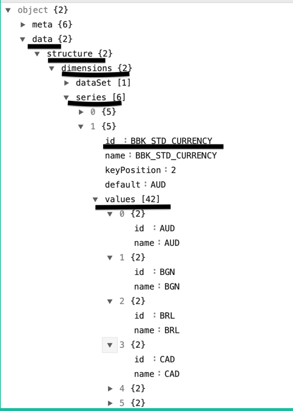
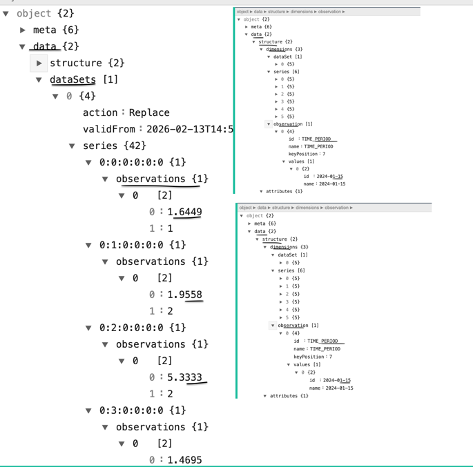
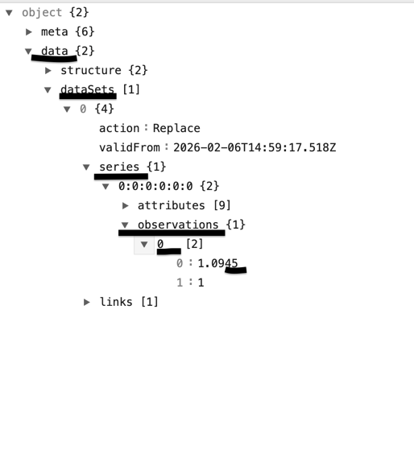
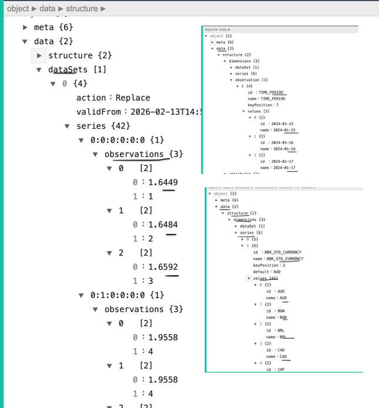

# AI_USAGE.md

## AI Tools Used
- **ChatGPT (OpenAI)** – used as a conversational assistant for:
   - Understanding the Bundesbank FX API (SDMX)
   - Interpreting request/response structures
   - Designing API flows, caching strategy, and domain models

No code was blindly copy-pasted. All suggestions were reviewed, adapted, and implemented.

---

## 1. Research and Understanding of the Bundesbank FX API

### Prompt
How will I receive exchange rates from the Bundesbank Daily Exchange Rates public service?

### Relevant AI Response
The Deutsche Bundesbank provides an SDMX-based REST API:

```
https://api.statistiken.bundesbank.de/rest/data/{FLOW_REF}/{SERIES_KEY}
```

Examples:

Fetch all daily EUR-FX rates for All currency:
```
curl -H "Accept: application/vnd.sdmx.data+json;version=1.0.0" \
"https://api.statistiken.bundesbank.de/rest/data/BBEX3/D..EUR.BB.AC.000?detail=dataonly"
```

Fetch rates for a specific day:
```
curl -H "Accept: application/vnd.sdmx.data+json;version=1.0.0" \
"https://api.statistiken.bundesbank.de/rest/data/BBEX3/D..EUR.BB.AC.000?startPeriod=2024-01-15&endPeriod=2024-01-15"
```

### Reasoning
The suggested endpoints matched the official Bundesbank documentation and were validated manually using curl before being used in code.

---

## 2. Interpreting the Request and Response

### Prompt
How do I interpret the request and response from the Bundesbank FX API?

### Key Interpretation

| Part    | Meaning                                   |
|---------|-------------------------------------------|
| BBEX3   | ECB euro foreign exchange reference rates |
| D       | Daily frequency                           |
| USD     | Foreign currency                          |
| EUR     | Base currency                             |
| BB      | Bundesbank / ECB series                  |
| AC      | Average / reference rate                 |
| 000     | Standard suffix                          |

Wildcard example for all currencies:
```
BBEX3/D..EUR.BB.AC.000
```

### Design Decision
The response indicates:
**1 EUR = X foreign currency**

I normalized the SDMX response into a clean internal model:
```json
{
  "date": "2024-01-15",
  "baseCurrency": "EUR",
  "foreignCurrency": "USD",
  "rate": 1.0945
}
```


---

## 3. Getting All Available Currencies

### Prompt
Assess my approach: cache → API on miss → extract currency codes → return result.

### AI Suggestions
- In-memory cache (simple)
- Database-backed cache (production-grade)

### Final Decision
I chose **in-memory caching** for simplicity

### Endpoint Used 
```
curl -H "Accept: application/vnd.sdmx.data+json;version=1.0.0" \
"https://api.statistiken.bundesbank.de/rest/data/BBEX3/D..EUR.BB.AC.000?detail=serieskeyonly"
```
- using serieskeyonly returns only metadata, minimized payload size.
- Below is sample response from Bundesbank for data parsing clarity


---


---

## 3. Getting Rates on particular Date

- Same as above
 - For simplicity, Uses an in-memory cache keyed by (currency, date) to avoid repeated calls to the Bundesbank API.
 - For production, a persistent store combined with caching would be preferred to ensure durability and scalability.

### Endpoint Used
```
curl -H "Accept: application/vnd.sdmx.data+json;version=1.0.0" \
"https://api.statistiken.bundesbank.de/rest/data/BBEX3/D..EUR.BB.AC.000?startPeriod=2024-01-15&endPeriod=2024-01-15&detail=dataonly"
```

### below is being used to fetch per currency for converting amount if the rate is not found in cache

```
curl -H "Accept: application/vnd.sdmx.data+json;version=1.0.0" \
"https://api.statistiken.bundesbank.de/rest/data/BBEX3/D.USD.EUR.BB.AC.000?startPeriod=2024-01-15&endPeriod=2024-01-15&detail=dataonly"
```


---

---
## 4. To Get Rates at all dates for a currency
- ### Prompt:
  Retrieve all exchange rates for a given currency across available dates while:
- Preventing excessive memory usage
- Avoiding large response payloads
- Ensuring reasonable response times

### Options Considered
1. Restrict data using a date range  
   Example: all USD rates for 2024 only.

2. Restrict number of observations  
   Bundesbank supports:
    - `firstNObservations` (earliest values)
    - `lastNObservations` (most recent values)

3. Background backfill into a database, then paginate from the database.

4. Server-side pagination by time windows  
   (e.g., monthly slices), since SDMX does not support offset-based pagination.

### Data Volume Considerations
- 1 currency, 1 year ≈ ~250 observations (business days)
- 1 currency, 25 years ≈ ~6,000–7,000 observations
- All currencies × all dates can result in large, multi-MB responses

**Decision:**  
Limit requests to a maximum of **5 years**, keeping responses under ~5–10 MB and avoiding timeouts or memory spikes.

### Example External API Call


### Endpoint Used
```
curl -H "Accept: application/vnd.sdmx.data+json;version=1.0.0" \
"https://api.statistiken.bundesbank.de/rest/data/BBEX3/D..EUR.BB.AC.000?startPeriod=2024-01-15&endPeriod=2024-01-15&detail=dataonly"
```


#### Sample Response



### Final Decision
- For this challenge:
    - Support optional date range parameters.
    - If no range is provided, default to recent data using `lastNObservations`.
    - Enforce a maximum window to prevent excessive memory usage.
  
If `start` and `end` are not provided:
- Default to a reasonable recent window (e.g., last 30–90 days).
- Enforce a maximum range of **5 years**, which can be configurable as per the system requirements.
---

## 6. Use of AI Assistance

Apart from designing the APIs, AI prompts were actively used during development to:
- Generate and refine unit and integration test cases
- Explicitly focus on:
    - Edge cases and boundary conditions
    - Memory usage considerations
    - Exception handling scenarios
    - Potential race conditions in caching and concurrent access

The prompts were intentionally framed to guide the AI toward **production-like and defensive coding practices.**


